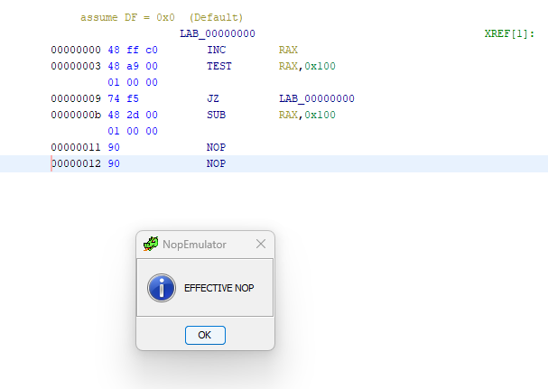
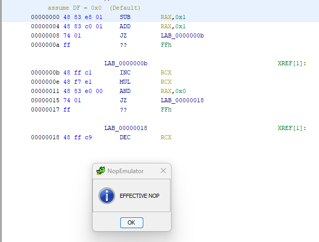

# NopEmulator

 Identification of Arbitrary Length Shellcode for the Intel x64 Architecture as a NOP Sled through Ghidra Scripting

## Summary

The NopEmulator is a Ghidra Script developed for the purpose of emulation Intel x64 instructions to determine if a Nop Sled is present in the binary. This tool originated from prior research that only used the ability to execute or parse the code as the only heuristic for valid Nop Sleds being present. This tool takes it one step further to emulate the instructions and validate if the resulting execution context is truly a Nop Sled. The tool can be applied to reverse engineering, malware analysis, and even to detecting exploits in network traffic that use Nop Sleds to transfer execution.

While using the tool, the analyst has the option to configure how the script operates based on analysis need. This includes modifying the registers being analyzed by ignoring unimportant ones or specific ones based on their analysis needs. The script can also run from start-to-end, address-to-addresd, address for a length of bytes, or full analysis. The full analysis does a full bruteforce pass of every possible start and end value looking for Nop Sleds hidden within the bytes. In addition, when found, a comment is added to the starting and ending addresses to make analysis easier.

This script does not just look for a sequence of 0x90 bytes within the code, although it will find those too, it actually emulates each instruction to determine if the code is __effectively__ a Nop Sled. Check the [Usage](#usage) section for more examples of how it works.

## Features

- Four different types of analysis
  1. Start to End
  2. Start Address to End Address
  3. Start Address with Length
  4. Full analysis
- Ignoring Registers
- Setting initial values

### Start to End

The start to end analysis emulates the entire sequence of bytes as Intel x64 architecture instructions and keeps track of beginning and ending values of the execution context. The execution context, consisting mainly of registers, will be compared between the initial values and the ending values to determine if the byte sequence is a Nop Sled.

### Start Address to End Address

During your analysis, you find a large sequence of bytes you want to analyze more closely, but you don't want to emulate the entire program; picking a starting and ending address will help! You can specify the beginning and ending address for analysis and NopEmulator will only execute those instructions and determine if that sequence of bytes is a Nop Sled. This can speed up any reverse engineering task when it's obvious that a sequence of bytes effectively makes no change to the state of execution within the program.

### Start Address with Length

Similar to the beginning and ending address option, potentially you just want to analyze the next X bytes from where you are. Great! Enter the starting address and the length you want to analyze and NopEmulator will emulate those instructions and give you your result as well. It's important to have flexibility in your analysis tools.

### Full Analysis

Full analysis is the heaviest version of analysis this tool does. As an initial pass, one could certainly ask, "I wonder if there are __ANY__ Nop Sleds __ANYWHERE__ in this byte sequence?" In fact, full analysis is the answer for that. Full analysis will brute force every starting and ending offset in the byte sequence looking for NopSleds. In addition, when it finds one, it will add a comment in the Listing window at the beginning and ending addresses to make analysis easier. This can be useful for finding any length byte sequences that don't change the state of execution and could be ignored during analysis. This may be a result of poor coding practices, obfuscation, or when looking at an exploit byte sequence, an indication that a Nop Sled is present in the payload.

## Usage

### Start to End Example

Let's walk through using the script with a simple example of the default analysis. For this example, a basic Nop Sled was created that involved looping a few simple instructions 0x100 times before continuing on. Effectively, this does nothing, but most of the instructions do not look like NOPs.

First, start up the script and you'll see a dialogue box to select which analysis you'd like to perform.

Click 'Ok' to move onto register selection. For register selection, there is a default selection of registers that are ignored including the EFLAGS register (and it's component flags) and the instruction pointer (RIP).

We will accept the defaults for this example by clicking 'No'. Next, you can specify if you would like to modify the initial values of any register. This might prove useful if the Nop Sled requires certain values to be set at the beginning of execution.

Once again, for this example, we'll leave it with the default values (0) and click 'No'. Once you click 'No', the analysis begins and returns our result.

Here we can see that the NopEmulator script correctly determined the byte sequence is in fact a Nop Sled!

### Start Address to End Address Example

Let's do another example with a new byte sequence and demonstrate the usage of starting and ending addresses within NopEmulator. Execute the script and select the "Start Address to End Address" option from the drop-down menu.

Click 'Ok' to continue. We will keep the defaults again for now; click 'No' for ignoring registers and setting values. The script will now present you with a dialog box to enter the starting and ending addresses. These addresses can be seen on the left side of the bytes in the Listing window.

The addresses have been circled in red for clarity. Enter your start address and click 'Ok'. Repeat again for your ending address. At first, we'll choose 0 and 1a. This is functionally equivalent to the beginning to end analysis from before, but we'll demonstrate what may happen when different addresses are selected afterwards.

Here we can correctly see that NopEmulator was able to determine that this byte sequence is a Nop Sled. Additionally, the disassembly changed from the initial analysis. NopEmulator realized that the instructions couldn't be executed successfully as they were disassembled initially and stepped past the bad 0xFF byte and re-disassembled the instructions to continue going. This gives a clearer picture of what was actually emulated and corrects minor attempts at obfuscation!

Let's see what happens if we skip the first intruction next, we'll select 4 as the starting address and 1a as the ending address.

Unfortunately, once we changed the starting address the byte sequence was no longer a Nop Sled. Not only does the alert box tell us, but the log below also shows the RCX value was not 0 like it was initially. In addition, the disassembly still looks the same, as the emulator did not take the first jump at the JZ instruction at address 0x8 because the SUB and ADD instruction together are what set the zero flag (ZF) to trigger that jump.

Let's do one more example with this analysis and ignore that RCX register we know will cause a problem. To do this, we will select 'Yes' when asked to ignore a register. When ignoring registers, all the defaults are thrown away and must be included again if you want to use them. The value to enter into the ignore register to include the defaults will be: `"ZF;PF;CF;AF;SF;DF;OF;RIP;RCX"`. The value must include the quote characters and the semicolon separator as is required by Ghidra's argument parsing routines.

Leaving all the other values the same, we once again receive our 'EFFECTIVE NOP' alert box. Ignoring the RCX register tells us that none of the other registers have been affected and if our analysis allows us to ignore that register, why not have the flexibility in your tool to do the same.

### Full Analysis Example

Finally, we'll do one more example with the Full Analysis option. This mode will look for all possible Nop Sleds within the byte sequence and due to the O(n^2) algorithm for every possible starting and end-of-instruction position, this can take quite a long time for longer byte sequences. The full analysis calculates the end of the instructions and determines if part of the instruction is included in the here-to-there values. If the end value is part of an instruction, the end values is adjusted to include the full instruction. This increases the reliability of the NOP detection and decreases the number of ending addresses to test for the full analysis.

For this example, the byte sequence is only 0x10 bytes long. We'll keep the default values and registers too.

Now we let the full analysis run. To minimize the number of images for this output, only one has been selected to demonstrate the output, but if you'd like to run this example yourself then load the `jmp_zero_nop.bin` file in the `simple_control_flow` folder and run `Full Analysis` yourself!

We can see the comments have been added indicating the beginning and ending addresses for the possible Nop Sleds. There is a corresponding BEGIN comment with every END comment and both include the starting and ending addresses for clarity. While the script goes through every byte, not all instructions are valid when disassembled at every offset so it is expected to see gaps in the comments.

For example, there is a Nop Sled in this example from 0x0 to 0xa, from 0x1 to 0xa, and from 0x4 to 0xa. In this case, starting at 0x2 and 0x3 do not result in a Nop Sled when stopping at 0xa.

Lastly, for clarity, the script does not leave the bytes disassembled as this causes the comments to become quite verbose around instruction as many instructions would then assume the comments for bytes that started within their instruction that are also valid. If you'd like to disassemble the bytes at this point, simply press 'd' and let Ghidra handle that for you. After all, its your analysis, don't let a tool author's decision hinder your progress!

## Installation

1. Simply clone the code base and include the path in Ghidra's Bundle Manager, which can be accessed in the Script Manager window.

### Requirements

- This script runs in the Ghidra Reverse Engineering tool available [here](https://www.ghidra-sre.org)

## License

NopEmulator is free, open source, and released under the MIT License.

## Changelog

### Version 1.0

- Added start to end analysis
- Added starting address to ending address analysis
- Added starting address with length analysis
- Added Full Analysis
- Dialog boxes for easy configuration of script execution
- Support for x64 Intel architecture
- Initial algorithm implementation as a Ghidra Script
